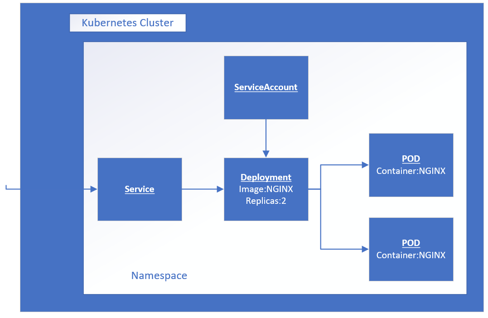

# Learn to run apps on AKS - Step 2 of 3 

 

### Kubectl Cheat sheet https://kubernetes.io/docs/reference/kubectl/cheatsheet/

### helpful commands:
#### list files: *ls*
#### view file: *cat my-file.yaml*
#### Show K8s objects: *kubectl get all --namespace=my-namespace*

## All commands can be executed by copying from browser to the AZ CLI: >_

14. to Save us typing - let's create a linux ALIAS for the kubectl.exe command:

```
alias k=kubectl
```

9. Check that the alias works:

```
k version
```

### Now we are ready to go. To deploy our NGINX app in a container to AKS using best practice we have 4 ordered tasks to do:
- Create a new isolated space in the K8s cluster to run our container. Called a NAMESPACE
- In the new namespace create a new SERVICE ACCOUNT - this will in future link access permissions that your container has to access the AKS cluster (API)
- In the new namespace create a new DEPLOYMENT - this will store information as to what image, how many copies and where the container(s) hosted in PODS will be deployed.
- In the new namespace create a new load balancer SERVICE - this will store information as to how to expose the PODS to our browser.

### We will perform each task by creating and in future editing a YAML text file. This so we can edit and apply to any K8s cluster, saved into source control such as GIT and applied through GitOps.

## - Important. Replace firstname with your own first name

12. Create a new yaml formatted text file (firstname-ns.yaml) containing a new NAMESPACE by using the kubectl command:

```
k create namespace firstname --dry-run=client --output yaml > firstname-ns.yaml
```

13. From the AZ CLI - view the content of firstname-ns.yaml:

```
cat firstname-ns.yaml
```

14. From the AZ CLI - use the yaml file to create the actual NAMESPACE in the AKS cluster:

```
k create --filename firstname-ns.yaml
```

15. From the AZ CLI - switch into this NAMESPACE (if you don't, you will need to include -n=firstname in every following command):

```
k config set-context --current --namespace=firstname
```

16. Create a new yaml formatted text file (firstname-sa.yaml) containing a new SERVICEACCOUNT in your own NAMESPACE: 

```
k create serviceaccount firstname-sa --namespace=firstname --dry-run=client --output yaml > firstname-sa.yaml
```

17. From the AZ CLI - view the content of firstname-sa.yaml:

```
cat firstname-sa.yaml
```

18. From the AZ CLI, use the file to create the actual SERVICEACCOUNT in AKS:

```
k create -n=firstname --filename firstname-sa.yaml
```

19. Create a new yaml formatted text file (firstname-deploy.yaml) containing a new DEPLOYMENT (firstname-deploy) in your own NAMESPACE: 

```
k create deployment firstname-deploy --dry-run=client -n=firstname --replicas=1 --image=nginx --output yaml > firstname-deploy.yaml
```

20. From the AZ CLI - view the contents of firstname-deploy.yaml:

```
cat firstname-deploy.yaml
```

21. From the AZ CLI - use the file to create the actual DEPLOYMENT in AKS:

```
k create -f firstname-deploy.yaml
```

22. Create a new yaml formatted text file (firstname-service.yaml) containing a new SERVICE pointing to your DEPLOYMENT (firstname-deploy) in your own NAMESPACE:

```
k expose deployment firstname-deploy --name=firstname-loadbalancer --type=LoadBalancer --port=80 --target-port=80 --dry-run=client -n=firstname -o yaml > firstname-service.yaml
```

23. From the AZ CLI - view the contents of firstname-service.yaml:

```
cat firstname-service.yaml
```

24. From the AZ CLI - use the file to create the SERVICE (Azure load balancer) in AKS:

```
k create -f firstname-service.yaml
```

25. Check to see if all the objects are ready. Repeat until you can obtain the IP address of the load balancer: 

```
k get all -o wide
```

26. Run a browser and enter the IP address as below. All being well you should see the homepage of the NGINX app 

*http://ip-address*

```
k logs  --namespace firstname
```

### Congratulations - you now know how to deploy a single application container to AKS using best practice YAML files!! 

15. Go to step 3


    


