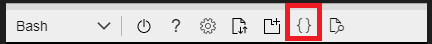

# Learn to run apps on AKS - Step 3 of 3

## Configure and lock down wherever possible updating the yaml files using the AZ CLI and re-deploying:

  

- Apply RESOURCE QUOTA to you NAMESPACE

1. From the editor paste in the following yaml and save as resourcequota.yaml

```
apiVersion: v1
kind: ResourceQuota
metadata:
  name: mem-cpu-demo
spec:
  hard:
    requests.cpu: "1"
    requests.memory: 1Gi
    limits.cpu: "2"
    limits.memory: 2Gi
```

2. Apply the Quota to your namespace
```
kubectl apply -f resourcequota.yaml --namespace=firstname
```

3. View detailed information about the ResourceQuota:

```
kubectl get resourcequota mem-cpu-demo --namespace=firstname --output=yaml
```

4.
- Apply DEPLOYMENT POD SERVICEACCOUNT: Not mount a security token hence revoking permissions to the K8s API server, prevent containers running as root (admin), cannot escalate, read only file system, minimum capabilites.
- Apply REPLICAS to increase the number of PODS each hosting a single NGINX container to 2.
- Apply CONTAINER RESOURCES REQUESTS: 20% of a CPU Core upon startup and LIMITS to 20% of CPU.
- Apply CONTAINER RESOURCES REQUESTS: 200MB of memory at startup and LIMITS to 200MB of memory.
- Apply CONTAINER READINESS PROBE to determine if the container should receive traffic.
- Apply CONTAINER LIVENESS PROBE to determine whether a container is responsive. If not kill it and create new one.
- Apply ENVIRONMENT variable whose value can be read by the CONTAINER
- Add a BUSYBOX sidecar container

5. Copy the code below to an editor and perform a search and replace on firstname to your name.  

## Edit the DEPLOYMENT yaml text file using the AZ CLI online editor {}. 

6. Open the deployment yaml file (firstname-deploy.yaml) by first clicking the icon for the AZ CLI editor {} and then pasting over the new code.

```
apiVersion: apps/v1
kind: Deployment
metadata:
  labels:
    app: firstname-deploy
  name: firstname-deploy
  namespace: firstname
spec:
  replicas: 1
  selector:
    matchLabels:
      app: firstname-deploy
  strategy: {}
  template:
    metadata:
      labels:
        app: firstname-deploy
    spec:
      serviceAccountName: firstname-sa
      automountServiceAccountToken: false
      containers:
      - image: busybox
        name: busybox
        securityContext:
          allowPrivilegeEscalation: false
          readOnlyRootFilesystem: true
          runAsUser: 0
        env:
        - name: MESSAGE
          value: "hello world"
        command: ["/bin/sh"]
        args: ["-c", "sleep 10000"]
        volumeMounts:
        - name: pod-storage
          mountPath: /data
      - image: nginx
        name: nginx
        securityContext:
          allowPrivilegeEscalation: true
          readOnlyRootFilesystem: false
          runAsUser: 0
          capabilities:
           # drop: 
            # - all
            add: 
             - NET_BIND_SERVICE
        env:
         - name: NEWS_URL
           value: http://bbc.co.uk/news
        resources:
          limits:
            memory: "200M"
            cpu: 0.20
          requests:
            memory: "200M"
            cpu: 0.20
        livenessProbe:
          httpGet:
            path: /
            port: 80
          initialDelaySeconds: 3
          periodSeconds: 3
        readinessProbe:
          httpGet:
            path: /
            port: 80
          initialDelaySeconds: 3
          periodSeconds: 3 
      volumes:
      - name: pod-storage
        emptyDir: {}       
  

```

7. From the Editor click ... Save

8. From the AZ CLI - list the file then use the file to update the actual DEPLOYMENT in AKS:

```
ls
```

```
k apply -f firstname-deploy.yaml
```

9. Now get K8s to return a yaml for the updated configuration:

```
k get deploy firstname-deploy -o yaml
```

10. Check to see if all the objects are ready. Repeat until you can obtain the IP address of the load balancer: 

```
k get all -n firstname
```

```
nigel@Azure:~$ k get all -n firstname
NAME                                    READY   STATUS    RESTARTS   AGE
pod/firstname-deploy-5db79fcb6c-qp6x5   2/2     Running   0          5m54s

NAME                             TYPE           CLUSTER-IP   EXTERNAL-IP    PORT(S)        AGE
service/firstname-loadbalancer   LoadBalancer   10.0.58.29   20.50.108.59   80:31079/TCP   129m

NAME                               READY   UP-TO-DATE   AVAILABLE   AGE
deployment.apps/firstname-deploy   1/1     1            1           10m

NAME                                          DESIRED   CURRENT   READY   AGE
replicaset.apps/firstname-deploy-5c5548996    0         0         0       4m13s
replicaset.apps/firstname-deploy-5db79fcb6c   1         1         1       5m54s
replicaset.apps/firstname-deploy-7665c6ccf7   0         0         0       10m
replicaset.apps/firstname-deploy-848c64d7c7   0         0         0       7m37s
replicaset.apps/firstname-deploy-cc4c59b69    0         0         0       5m11s
nigel@Azure:~$ 
```

11. Run a browser and enter the IP address as below. All being well you should see the homepage of the NGINX app 

*http://20.50.108.59*

12. In the Azure Portal select the AKS cluster and click Workloads. Navigate freely to see K8s objects that have been created.

13. Go to GitOps.


    


